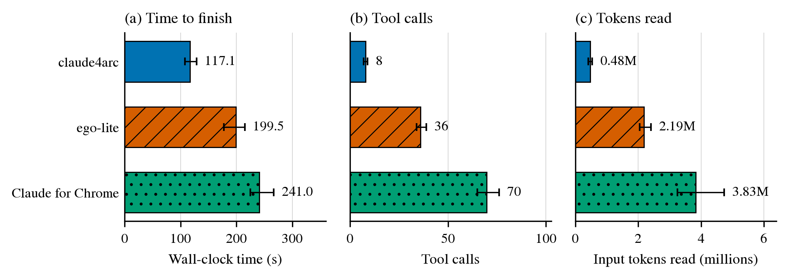
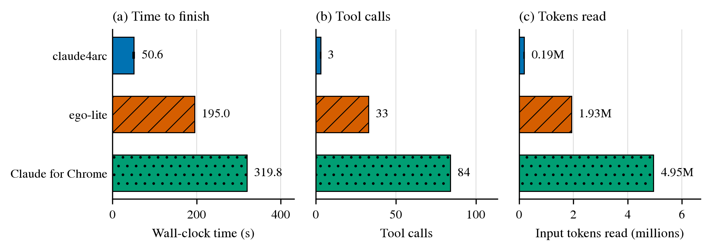

# Benchmark

This folder compares three browser tools for Claude Code on the same tasks:
claude4arc, ego-lite, and Claude for Chrome. The tool was named `arc-browser`
during the early runs; the results use the current name.

## Held-out tasks

The fair comparison. claude4arc was never run on these tasks before the
measured runs, and its code was frozen at commit `b9cc78f` for them. Each tool
ran three times; the table shows the mean and the range.



| Tool | Tasks passed | Time | Tool calls | Input tokens read |
|---|---|---|---|---|
| claude4arc | 42 / 42 | 117.1 s (107.9–128.8) | 8.0 (7–9) | 0.48 M (0.41–0.54) |
| ego-lite | 42 / 42 | 199.5 s (177.6–215.1) | 36.0 (34–39) | 2.19 M (2.05–2.41) |
| Claude for Chrome | 42 / 42 | 241.0 s (224.8–266.8) | 69.7 (65–76) | 3.83 M (3.26–4.74) |

The tasks ([INSTRUCTIONS-heldout.md](INSTRUCTIONS-heldout.md)) are 10 new
fixture pages (a multi-step wizard with card-style radio buttons, an
autocomplete combobox, a modal with a scrolling body, a sortable table, tabs
with an ARIA switch, a plain `contenteditable` note, a paginated list, a file
upload, a web component inside an iframe, and a slider with a search box that
submits on Enter) and 4 new lookups on Wikipedia, MDN, GitHub, and Hacker News.
`node bench/verify.js` checks every recorded value.

On these tasks claude4arc needed about twice its tuned-task time, mostly
because its agent retried steps on the wizard, the scrolling modal, the hidden
tab, and the paginated list. Those four weak spots were fixed after the
measured runs (see the changelog), so the numbers above describe the version
before the fixes.

## Original tasks

claude4arc was tuned on these tasks over eleven runs, so treat this
comparison as an upper bound.



| Tool | Tasks passed | Time | Tool calls | Input tokens read |
|---|---|---|---|---|
| claude4arc | 14 / 14 | 50.6 s (mean of 49.4 and 51.7) | 3 | 0.19 M |
| ego-lite | 14 / 14 | 195.0 s | 33 | 1.93 M |
| Claude for Chrome | 14 / 14 | 319.8 s | 84 | 4.95 M |

## Method

- Each run is a fresh Claude Code subagent on the same model. It gets only
  its tool's skill or tools and [INSTRUCTIONS.md](INSTRUCTIONS.md).
- There are 14 tasks: 10 local fixture pages (a form, a cross-origin iframe,
  a confirm dialog, a virtual list, drag and drop, a popup window, a code
  editor, a closed shadow root, delayed content, and a hover menu) and 4
  lookups on real sites (Wikipedia, GitHub, Hacker News, MDN).
- Each fixture page reports its result to the benchmark server, which appends
  it to a log. The published runs are in `results/records.jsonl`. A task counts as passed only when the server
  recorded the expected value, not when the agent says so.
- Time, tool calls, and context size come from the Claude Code harness. Its
  tool-call count includes loading the skill and the agent's final report, so
  claude4arc's 3 calls are the skill, one browser call, and the report.
  "Input tokens read" is the sum of the input tokens of every model turn, from
  the agent transcripts. Each turn reads the whole conversation again, so this
  number follows cost.

## Limits

- On the original tasks, claude4arc was improved against the same tasks over
  eleven runs (`results/arc*.json`), and ego-lite and Claude for Chrome ran
  once each. The held-out tasks remove that advantage.
- Three runs per tool show the size of the difference, not a precise value.
- In the held-out benchmark, ego-lite and Claude for Chrome ran at the same
  time as each other (in different browsers). Their third runs were stopped
  by an account usage limit and restarted with new run ids (`-h3b`).
- Claude for Chrome passed every task, but its agent used workarounds: it
  replaced `window.confirm` in JavaScript, opened the popup's URL in a new tab,
  and used the Tab key inside the cross-origin iframe.
- The published runs used `date +%s%3N` for per-task timestamps. macOS `date`
  has no `%N`, so some of those timestamps have one-second precision. Total
  times come from the harness and are not affected. INSTRUCTIONS.md now uses
  a command that works on macOS.

## Run it yourself

Start the fixture server (ports 8900 and 8901):

```bash
node bench/server.js
```

Then give a fresh Claude Code agent the instructions in
[INSTRUCTIONS.md](INSTRUCTIONS.md), with a unique run id and one tool. New
results go to `results/records.local.jsonl`, which git ignores, so the
published `records.jsonl` stays unchanged. Set `BENCH_RECORDS=<path>` to write
somewhere else. Check the results:

```bash
grep '"run":"<run id>"' bench/results/records.local.jsonl
```

The scripted runs measure the tools without a model in the loop:

```bash
claude4arc run < bench/scripted-arc.js
```

`scripted-ego.js` is the same script for ego-lite's script runner.

To draw the figure again (needs matplotlib):

```bash
python3 bench/figures/make_figure.py
```

## Files

| Path | Contents |
|---|---|
| `INSTRUCTIONS.md`, `INSTRUCTIONS-heldout.md` | the task lists the agents received |
| `verify.js` | checks the values the fixture pages recorded for each run |
| `pages/` | the fixture pages |
| `server.js` | the fixture server and result recorder |
| `results/*.json` | each agent's own report, with per-task timestamps |
| `results/*.meta.json` | harness figures for each run, and the tokens read |
| `results/records.jsonl` | results recorded by the fixture pages in the published runs |
| `results/scripted*.json*` | scripted runs without a model |
| `report.html` | an interactive report of all runs |
| `figures/` | the figures above and the script that draws them |
